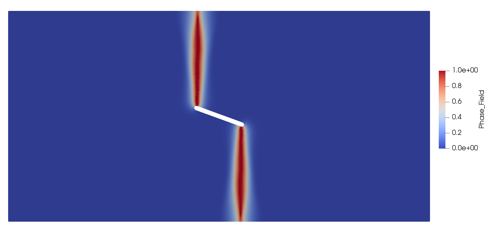
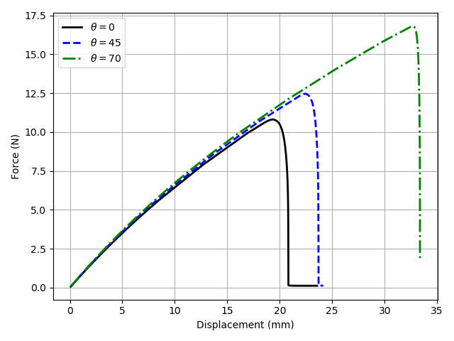

# Different center crack orientation videos

## 0 degrees

<video controls src="videos/center0degree.mov"  width="100%" />

## 45 degrees

<video controls src="videos/center45degree.mov"  width="100%" />

## 70 degrees

<video controls src="videos/center70degree.mov"  width="100%" />

## Force-Displacement Curves
The fracture toughness increases with increasing angle as expected. There doesn't seem to be any interesting behavior here surprisingly. 

