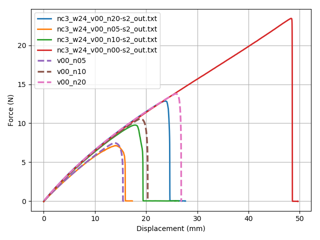
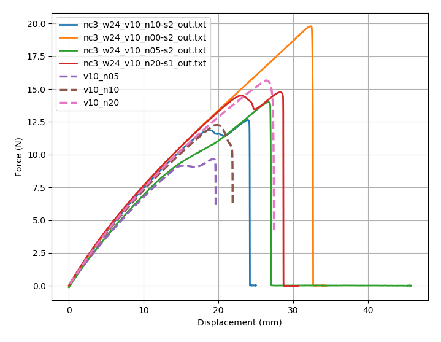
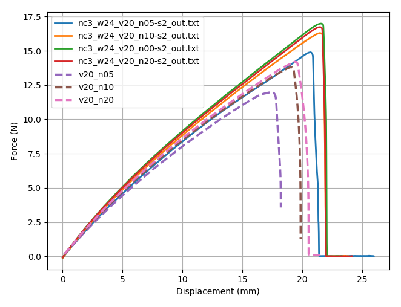
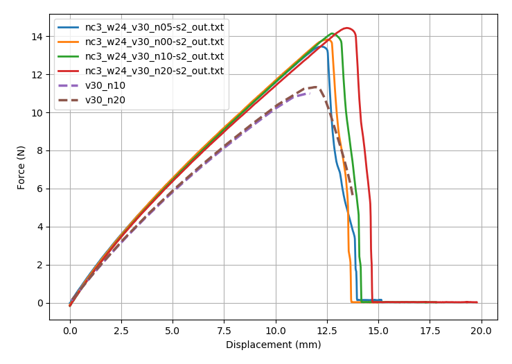
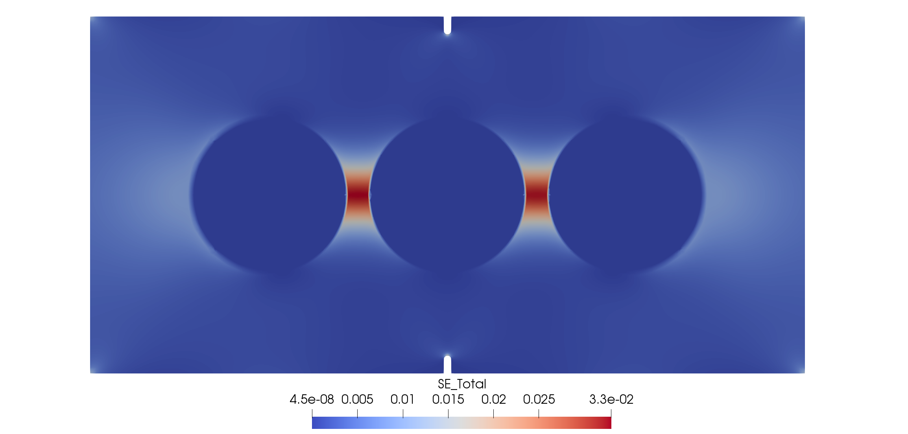
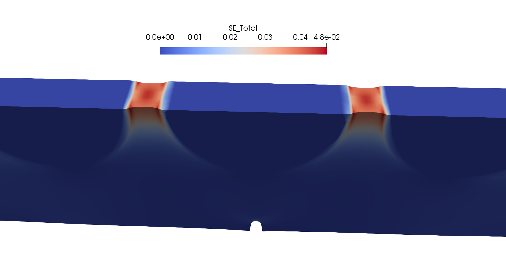

# Update June 8, 2019
Author: Jonathan Russ

## Good News & Bad News
### Good news first:
Slava was able to run many additional tests and provided me with the corresponding test data. The data variation across groups of samples that were printed and tested on "different days" is quite large but the data within each set has relatively low variation.
Very briefly, Slava performed tests with 3 different notch lengths for 3 different sizes of inclusions (for the 3 circular inclusion geometry) and one set of tests with the same 3 notch lengths without inclusions. His labels are as follows:
format = 'vXX_nYY' where XX = volume fraction of inclusion material and YY is related to the notch length by NotchLength = WidthOfSample / YY. (Note he also ran tests without notches where YY = 0 but I have not simulated those tests).
I used the data without inclusions to calibrate the hyperelastic material parameters and the phase field fracture parameters. In the plot below, the dashed lines represent my simulation data. NOTE that I am over-predicting the peak force. This is important for the bad news later.

Next, using those material properties I ran the first set of tests with the smallest radius inclusions. The actual failure pattern is different after the crack propagates from the notches to the center inclusion but the force displacement curves at least appear slightly similar (i.e. the initial part of the curve is not too far off and the peak forces are roughly the same except for the experiment with the largest notch v10_n05 which I would not be able to predict numerically).

Next, the same parameters were used for the tests with 20-percent volume fraction inclusions and some significant deviation is shown in the force-displacement curves below. NOTE that here I am under-predicting the peak force in contrast to the simulations without inclusions above!

Finally, two simulations with the largest set of inclusions were completed (only one run to failure since the other is still running) and very large deviations from the test data are found as shown below. I believe I know the root cause and I outline this in the bad news below. NOTE that here again I am significantly under-predicting the peak force! 

### Bad news
Each of the above simulations were performed in 2D with a plane stress assumption. Without inclusions this approximation is valid and very good (as would be the case if there were holes instead of inclusions). However, with rigid inclusions the plane strain assumption completely breaks down and there is a strong 3D effect. To test this hypothesis I ran a few time steps of the geometry in 3D for the v30_n20 sample and plot the strain energy density. As shown below, near the inclusions there is a very large stiffening effect that I cannot capture in 2D. This assumption clearly has a large impact on the quality of the prediction, not only when the inclusions are large but also when the crack is propagating near the inclusions as well.

Here is a plot of the strain energy density in 2D with a poissons ratio of 0.4999 and plane stress assumption.

Here is the same geometry except in 3D with a poissons ratio of 0.45 (I needed to decrease it due to the lack of an appropriate method for mitigating volumetric locking in my 3D implementation). Note the large difference in the strain energy density and the variation through the thickness. The energy is much higher in 3D despite the fact that poissons ratio in 3D was significantly further away from an incompressible 0.5 unlike 2D with poissons ratio = 0.4999. I believe the loss of predicted stiffness in the beginning of the simulations with respect to the test data is caused by this 3D stiffening effect.

Additionally, this 3D effect would likely have a large impact on the failure simulation since the local strain energy density is significantly higher than predicted in 2D and this is was drives phase field fracture.

Unfortunately the simulations in 2D on my machine take approximately 1.5-2 days to run and I am limited to 6 hours on the supercomputer at Columbia. In 3D the size of the problem grows by a huge factor and it is simply not possible for me to run those fracture simulations in less than 6 hours. Writing restart files would require quite a bit of programming effort and even in this case the number of required restarts would be large. Consequently, my low priority on the supercomputer would likely require weeks in order for me to get through all of the simulations that would need to be completed for calibration of the material parameters and the 16 simulations with varying notch and inclusion sizes (it has taken over a week to get to this point in 2D with many simulations left uncompleted). Additionally, I would need to change the strain energy potential to one with a volumetric-isochoric split and the corresponding implementation to alleviate volumetric locking. I'm not sure what to do about all of these difficulties but I will think about it more this weekend. The only other option I see is removing the stiff inclusions and replacing them with voids so that the plane stress approximation remains valid. I will let you all know when I come up with a path forward. 

Thank you Slava for completing so many experiments and for trying so hard to reduce the surprisingly large variation in material behavior. I apologize for the current setback.
