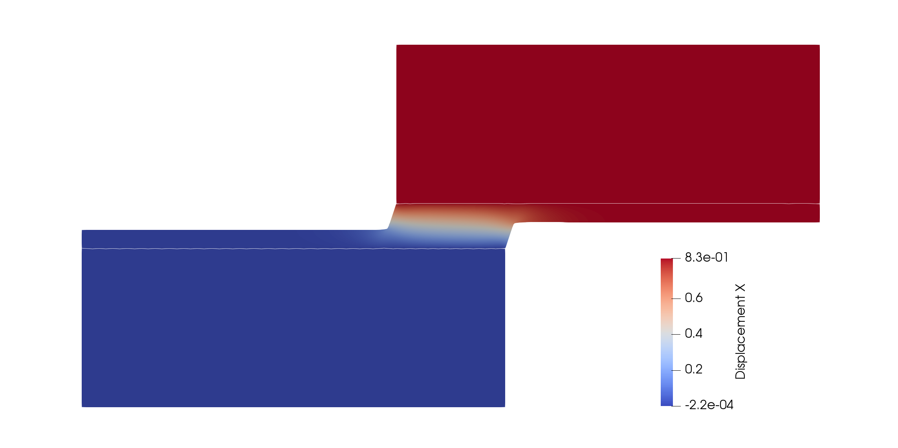
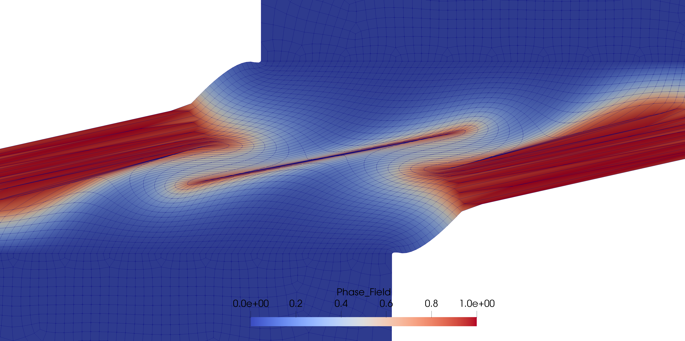

# Modelling Update
Date: May 11, 2019

Author: J.B.Russ

## Geometry with 3 inclusions
I reran this numerical experiment with a Poissons ratio of 0.499 as before. I noticed I had an error in my plot for this example only and corrected it. The force displacement curve is shown below. As you can see I actually underpredict (significantly) the peak force here. The behavior is different because symmetry was regained in the response which is not observed experimentally.

<video controls src="videos/inclusions.mp4"  width="100%" />

Note that I stopped the simulation early (it ran for approximately 1.5 days on my 4 processors) so I could run a different numerical experiment that will hopefully induce some shear via a simple tension test. 

## Search for a shear test
I first tried to induce some shear with the example below but this turned out to be a bad idea. The left end of the domain below was fixed and tension was applied only to the edge in between the 2 notches on the right end of the domain. The gray region represents the TangoPlus and the blue region represents the VeroWhite.

Since that didn't work out I parameterized the geometry below and played with the sizing of different parts of the domain. The left end is fixed and a positive displacement loading is applied to the rightmost edge. The material between the two white lines is TangoPlus and the stiff VeroWhite material is placed in the larger outer domains in order to provide some "support" for the very soft TangoPlus material.

1. I'm not sure if this is a good idea to attempt to perform this experiment since the behavior is very complicated and I doubt my simulations would be very accurate (especially with the complicated "shearband" that develops in the middle towards the end). What do you think about the ability to perform this test reliably Slava? It seems like the symmetry I develop would not be observed experimentally, and consequently, the "shearband" type deformation in the center would not be observed. If that is the case then I doubt there is any value added here.
2. I chose this example because it demonstrates a situation in which I cannot obtain numerical convergence after the last frame in the video. I honestly don't think my solution I proposed before could alleviate this problem since the deformation of the mesh is so intense even in regions where the phase field is not above 0.9 but I could try anyways. See the mesh distortion below.

<video controls src="videos/shear.mp4"  width="100%" />

Here is a simple png image of the mesh distortion intensity. There are 6 elements through the thickness of the "shearband" in the center which clearly is a very thin region.

## Questions/Remarks
1. I will continue thinking about this and the experiment with the 3 stiff inclusions. I'm still not exactly sure why I underpredict the peak force by such a large amount.
2. Slava - if you have any experimental insights you could offer me regarding either of these tests I would appreciate it. I'm not sure I fully understand what you meant before when you mentioned the existence of interphasial zones. Are you referring to locations where one of the two materials has diffused into the other? Perhaps it would be beneficial to talk over the phone sometime? Thank you!

