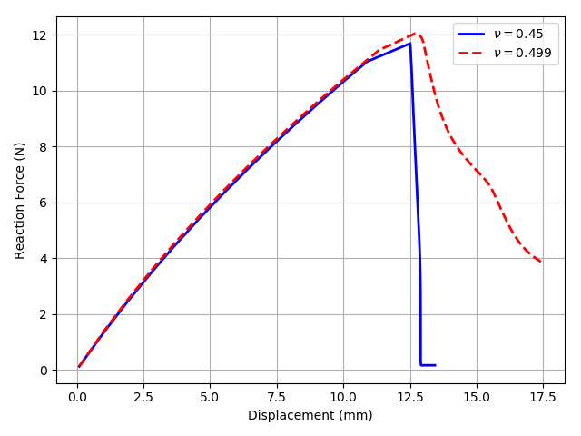

# Preliminary experiments on the hyperelastic composite materials with holes and inclusions
Date: May 11, 2019

Author: J.B.Russ

## Geometry with 3 inclusions
I reran this numerical experiment with a Poissons ratio of 0.499 as before. I noticed I had an error in my plot for this example only and corrected it. The force displacement curve is shown below. As you can see I actually underestimate (significantly) the peak force here. The behavior is different because symmetry was regained in the response which is not observed experimentally.

<video controls src="videos/inclusions.mp4"  width="100%" />

Note that I stopped the simulation early (it ran for approximately 1.5 days on my 4 processors) so I could run a different numerical experiment that will hopefully induce some shear via a simple tension test. I am fixing the left end of the domain below and applying tension only to the edge in between the 2 notches on the right end of the domain. The gray region represents the TangoPlus and the blue region represents the VeroWhite. Whenever this simulation finishes I will provide the results.

Thanks!
